<div align="center">

# GPU SPH Painting Simulation Engine

### Real-time GPU fluid-and-paint simulation in Unity

A custom academic simulation engine that models paint from a moving bucket, through GPU particle-based fluid dynamics, to deposition, spreading, drying, rewetting, color mixing, and runoff across multiple surfaces.


</div>

<p align="center">
  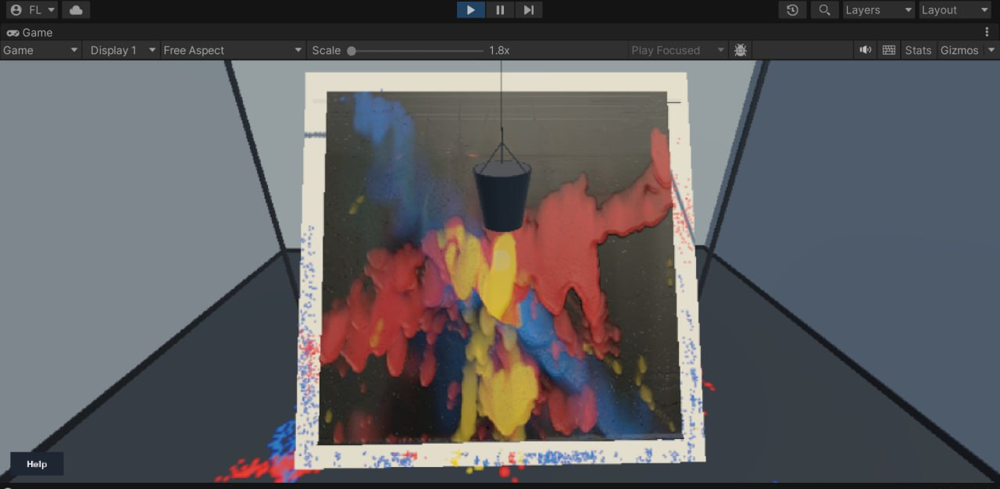
</p>

> **Portfolio showcase:** the current source repository is private. A short demo video and selected technical breakdowns will be published here. The project is an educational real-time simulation, not an industrial CFD solver.

---

## Demo

**Final edited video:** coming soon.

The screenshots below are current showcase captures from different project iterations. They will be refreshed with clean final-build captures when the edited demo video is ready.

<p align="center">
  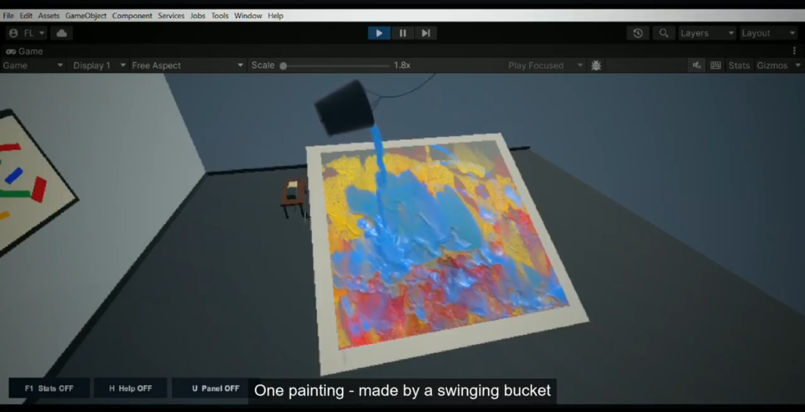
  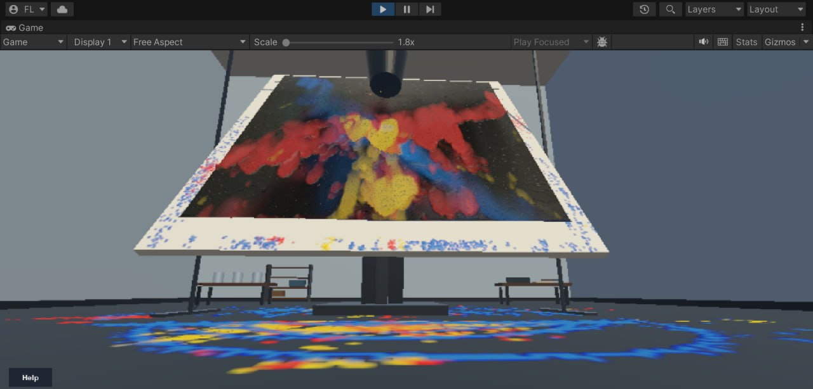
</p>

Recommended final video sequence:

1. Final paint result first.
2. Bucket and rope motion.
3. GPU liquid leaving one or more outlets.
4. Impact and conversion to a surface film.
5. Different paint/surface presets.
6. Edge runoff to the support surface and floor.
7. Image-to-paint import and profile/state saving.
8. Runtime statistics, diagnostics, and experimental solver scenes.

---

## What this project does

The system simulates a complete interactive paint pipeline:

```text
Moving bucket + rope rig
        ↓
3D GPU SPH fluid inside the bucket
        ↓
Bottom / side outlets and top spill
        ↓
Airborne particle stream
        ↓
Particle impact detection on the painting surface
        ↓
2D GPU wet-film simulation
        ↓
Spread / slope flow / absorption / drying / rewetting
        ↓
Edge drainage and environmental runoff
```

The main goal was not to use a ready-made fluid effect, but to build and integrate the simulation systems directly in Unity using C#, HLSL compute shaders, GPU buffers, and custom rendering.

---

## Technical highlights

### GPU SPH bucket solver

The primary painting scene uses a custom GPU SPH solver with:

- GPU spatial grids for fluid, outside particles, and boundaries.
- Density, pressure, acceleration, viscosity/XSPH-style smoothing, and integration passes.
- Circular-frustum and box container support.
- Moving-container response.
- Boundary support and collision handling.
- Surface-tension/cohesion controls.
- Inside/outside particle state handling.
- Indirect GPU particle rendering.

The core compute pipeline is implemented in:

```text
Assets/Resources/SPH/SPHFluidFrustumGPU.compute
```

### Multi-outlet and stream system

<p align="center">
  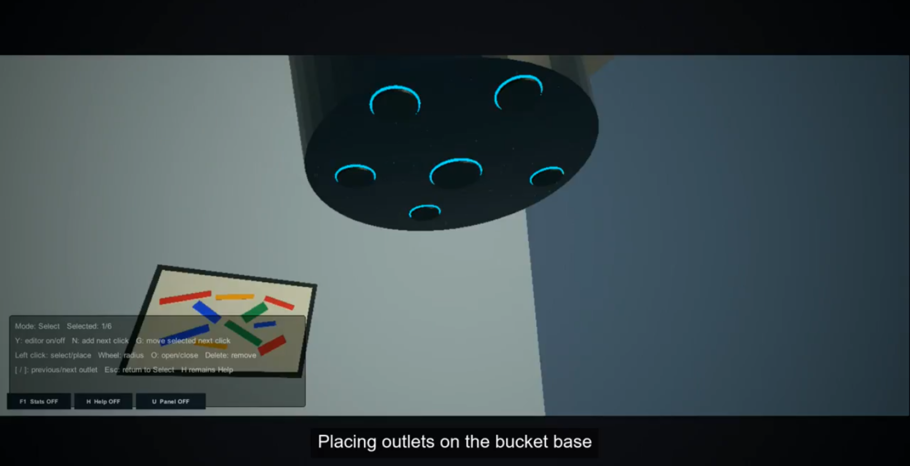
  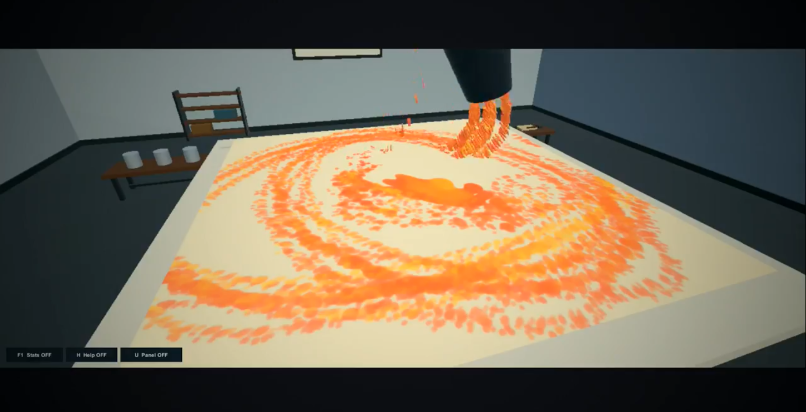
</p>


The bucket supports more than a single fixed hole:

- Bottom and side outlets.
- Runtime outlet creation/removal/editing.
- Per-outlet radius and flow controls.
- Open/close control for individual or all outlets.
- Top-spill mode.
- Continuous-nozzle transition controls.
- Controlled stream-emitter controls.
- Optional outside-only wind response.

### Hybrid 3D → 2D paint model

A major design decision was to avoid keeping every deposited paint particle alive indefinitely.

Instead, the system uses:

```text
3D SPH particles in the bucket and air
                    ↓
      GPU impact/deposition stage
                    ↓
2D paint film on the target surface
```

This makes it practical to model longer-lived surface behavior such as drying and absorption without representing the entire painted layer as persistent 3D particles.

### GPU surface-film simulation

The painting surface keeps GPU textures/state for properties including paint color, thickness, wetness, material behavior, absorbed pigment, and dry relief.

The film pipeline includes kernels for:

- Impact detection.
- Paint deposition.
- Film flux calculation.
- Film advection/application.
- Coverage statistics.
- Edge spill drainage.
- Image-to-paint import.
- Export composition.

Implemented mainly in:

```text
Assets/Resources/SPH/SPHCanvasPaint.compute
Assets/Scripts/Runtime/PaintingSystem/Canvas/SPHGPUCanvasSurface.cs
```

### Paint behavior presets

The interactive control system includes presets for:

- Line painting.
- Extra watery paint.
- Watery/flowing paint.
- Normal paint.
- Thick paint.
- Hybrid thick paint.

The parameters remain editable at runtime for experimentation.

### Surface-dependent behavior

<p align="center">
  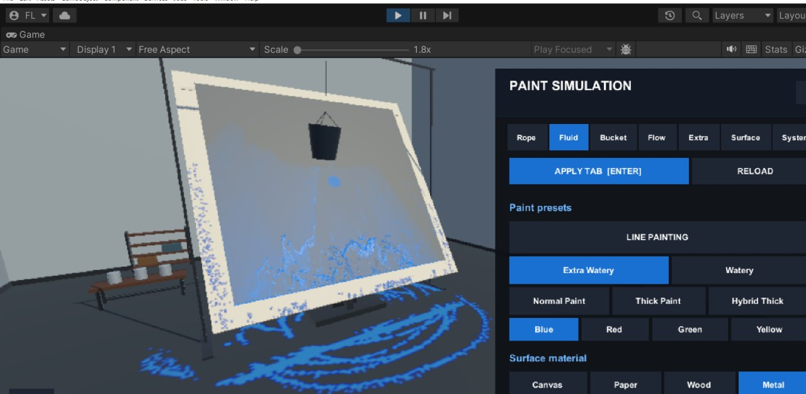
  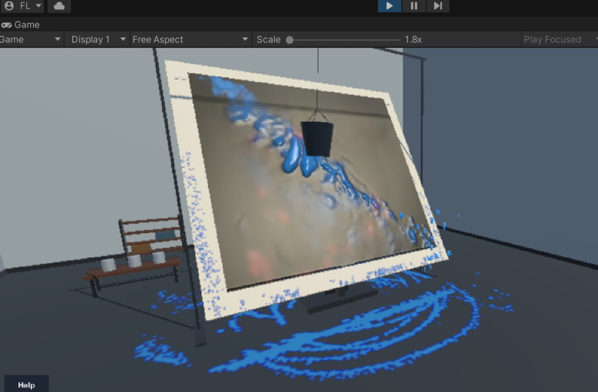
</p>


The painting model supports separate material behavior for:

- Canvas.
- Paper.
- Wood.
- Metal.

Surface selection changes parameters such as absorption, flow, friction/slip behavior, drying, and visual response instead of treating every surface identically.

### Drying, absorption, layering, and rewetting

<p align="center">
  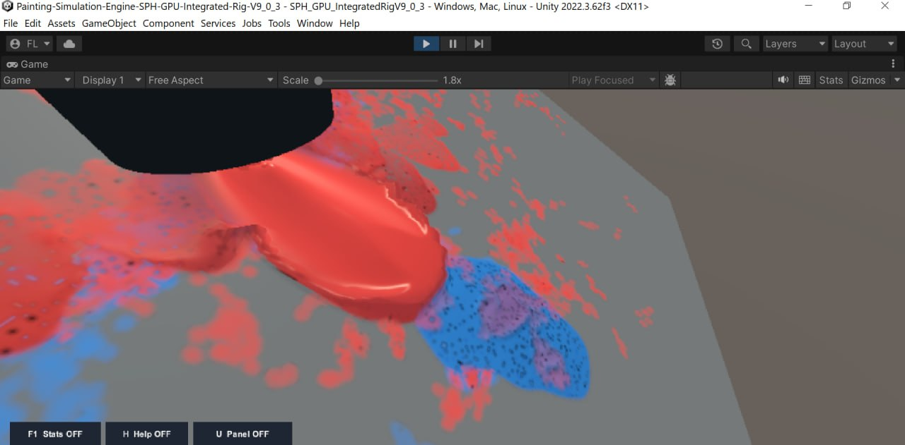
  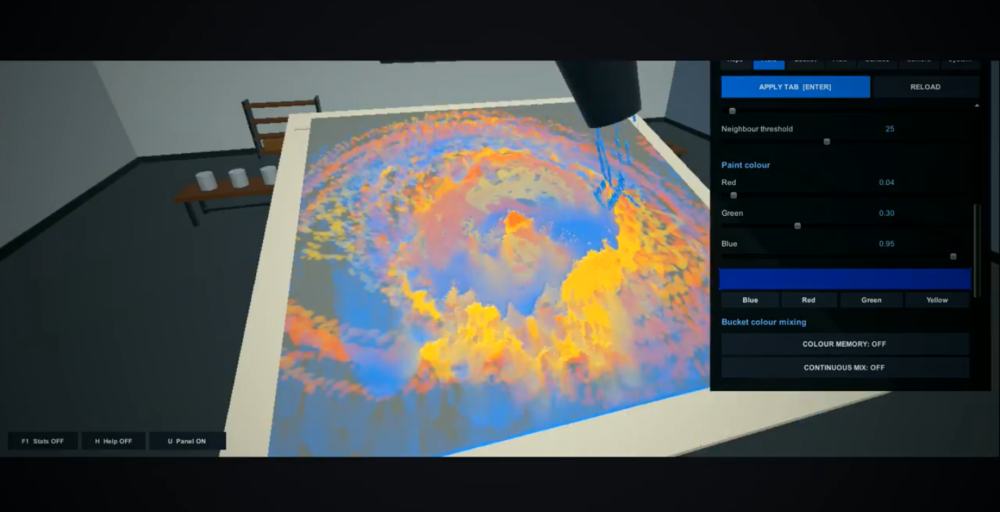
</p>


The film system contains configurable models for:

- Wet-film spreading.
- Slope-driven flow.
- Retained flow trails.
- Absorption and absorption capacity.
- Drying and thick-film retention.
- Dry-film relief.
- Rewetting.
- Wet-over-dry layering.
- Overcoat retention.

These are artistic/numerical approximations intended for a real-time simulation, not a chemical model of industrial paint.

### Image-to-paint import

<p align="center">
  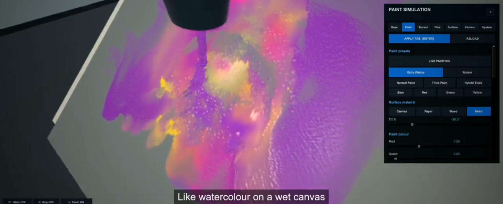
  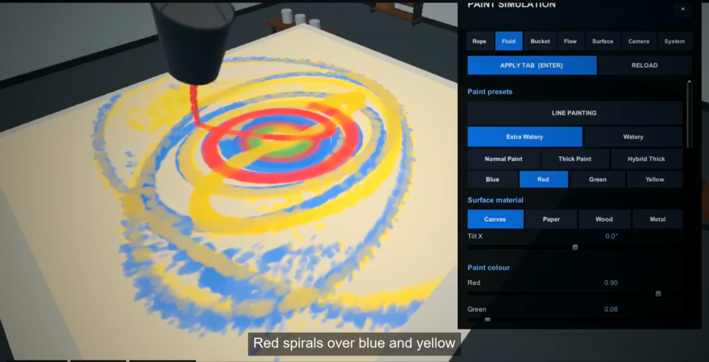
</p>


A user-selected image can be used as a visual background or converted into simulated paint.

Supported import modes include:

- Exact Paint.
- Artistic Layers.
- Dripping Paint.

Artistic presets include balanced painting, watery wash, heavy impasto, dripping artwork, and mixed media.

### Environmental runoff

Paint can continue beyond the main canvas through a separate GPU environment-trace system:

- Canvas edge drips.
- Hanging streams.
- Support-table film/runoff.
- Floor film/runoff.
- Environment impact deposition.

### Rope and bucket dynamics

The bucket is integrated with a custom interaction rig that includes:

- Mass-spring rope behavior.
- Damping and torsion controls.
- Three-point suspension/harness option.
- Pendulum/orbital launch presets.
- Spin and kick controls.
- Mouse drag-and-release launch.
- Manual bucket control.
- Analytic bucket/surface collision handling.

### Camera and presentation controls

The main scene supports:

- Perspective, front, side, and top views.
- Follow mode.
- Free camera.
- Normal and cinematic free-camera movement.
- Smooth camera transitions.

### Profiles and experiment state

The control system includes a 20-slot profile library with two levels of persistence:

- **Settings-only profiles** for paint/solver parameters.
- **Full-state profiles** that can also capture layout/runtime state and the current GPU paint film.

Profiles are versioned and stored locally using JSON, while full film snapshots are stored separately.

---

## Experimental solver scenes

The repository snapshot also contains separate solver scenes created during development for tuning, comparison, and scaling experiments. These scenes are **secondary engineering experiments**, not headline performance benchmarks for the painting system.

In the current tested build:

- Around **~100K particles** gave the best balance of responsiveness and fluid stability in the heavier experimental scenes.
- Around **~250K particles** was still useful for performance/scaling experiments on the tested hardware, but fluid stability was less consistent.
- Larger code-configurable budgets exist in some experimental scenes, but they are intentionally **not presented as validated real-time performance claims**.

The main portfolio focus remains the integrated painting pipeline: GPU SPH inside the moving bucket and in the air, followed by the GPU surface-film simulation after impact.

---

## Architecture

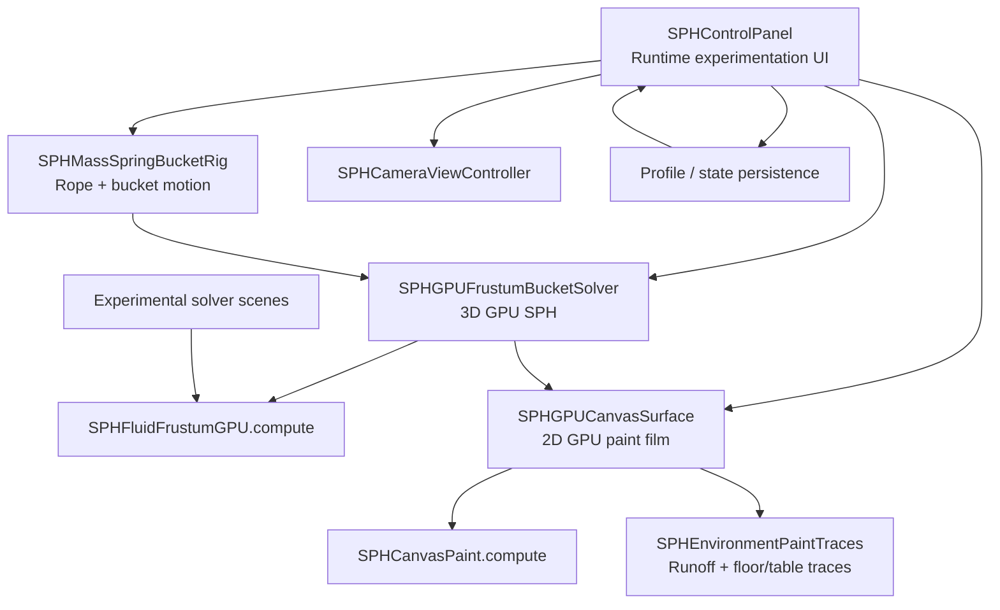

At the system level, the project is separated into fluid, bucket, rope/rig, surface-film, environment, camera, UI/profile, rendering, and experimental solver modules.

> **Engineering note:** several individual controller/solver classes are still large and would benefit from further refactoring into smaller services/components. This is one of the main code-quality improvements planned for a future iteration.

---

## Project snapshot

Current uploaded snapshot:

| Item | Count |
|---|---:|
| C# source files | 34 |
| HLSL compute shaders | 8 |
| Render shaders | 13 |
| Compute kernels | 89 |
| Unity scenes | 6 |
| C# lines | ~34K |
| Compute-shader lines | ~9K |

The counts are included only to communicate scope; they are not intended as a measure of code quality.

---

## Main scenes

| Scene | Purpose |
|---|---|
| `SPH_GPU_IntegratedRig_LinePainting` | Main bucket + rope + paint + surface experience |
| `SPH_GPU_DirectStableFluidLab` | Direct cohesive SPH tuning and comparison |
| `SPH_GPU_HighCountFluidLab` | Experimental particle-scaling scene |
| `SPH_GPU_HybridMillionFluidLab` | Experimental carrier/tracer visualization scene |
| `SPH_GPU_MillionPBFStableLab` | Experimental PBF comparison scene |
| Legacy Fluid Lab | Earlier solver/reference scene |

Five of these scenes are currently enabled in Unity Build Settings; the legacy scene is retained as a comparison/reference scene. Some development scene names reference very large particle budgets; those names reflect experimentation targets and should not be interpreted as validated real-time performance claims.

---

## Technology stack

| Technology | Role |
|---|---|
| Unity 2022.3.62f3 LTS | Runtime/editor platform |
| URP 14.0.12 | Rendering pipeline |
| C# | Runtime logic, interaction, editor tools |
| HLSL Compute Shaders | Fluid, surface-film, and runoff simulation |
| ComputeBuffer / RenderTexture | GPU-resident simulation state |
| Indirect GPU Rendering | GPU-efficient particle rendering |
| SPH | Primary particle-fluid model |
| PBF | Experimental solver comparison scene |
| Mass-Spring model | Rope/bucket rig |
| JSON serialization | Runtime profile persistence |
| Unity Recorder | Demo/experiment capture |

No external ML/AI service is used by the simulation at runtime.

---

## Runtime controls

The current build contains many runtime shortcuts. Key examples include:

```text
U                 Toggle main control panel
H                 Toggle help
F1                Toggle runtime SPH statistics
Enter             Apply current tab
Shift + Enter     Apply all editable tabs

Mouse drag/release  Launch/control bucket interaction
L / K / I           Orbit+spin / orbit / spin presets
P                   Pause rope/rig
Space               Weak wave
Shift + Space       Strong wave
B                   Open/close all outlets
Y                   Outlet editor

V                   Cycle fixed views
F                   Fixed / Follow / Free camera
F2..F5              Direct camera views
Alt + S             Normal / Cinematic free camera

Alt + 1..4          Canvas / Wood / Metal / Paper
Shift + 1..4        Blue / Red / Pink / Yellow
Shift + C           Clear canvas
Shift + X           Clear table/floor traces
```

The in-app help panel should be treated as the authoritative shortcut reference as the control map evolves.

---

## Validation and testing status

Current validation is primarily based on:

- Runtime manual tests.
- Independent solver laboratory scenes.
- Visual comparison.
- Runtime performance statistics.
- Density/pressure/neighbour/velocity diagnostics.
- Solver scaling experiments, with the most reliable tested balance around ~100K particles and exploratory runs around ~250K.
- Standalone Windows/DX11 testing.

The project does **not** currently contain a comprehensive Unity Test Framework suite or automated CI build pipeline.

Planned engineering improvements include:

- EditMode tests for profile serialization.
- PlayMode tests for profile/state restoration.
- GPU readback regression checks.
- Automated benchmark scenes.
- CSV performance export.
- CI build validation.

---

## Known limitations

- The physics is tuned for interactive visual stability and artistic behavior, not industrial CFD accuracy.
- Paint drying/absorption/rewetting are numerical approximations rather than full chemical material models.
- Performance is highly dependent on GPU, particle budget, neighbour limits, film resolution, and rendering mode.
- Experimental scaling scenes become progressively less responsive and less stable at larger particle budgets; they are not presented as benchmark claims.
- The main UI and some solver classes are large and should be decomposed further for long-term maintainability.
- Automated test coverage is currently limited.

---

## Repository / source availability

The project is currently presented as a **portfolio showcase** while the full source remains private.

This allows the project architecture, technical decisions, demos, and results to be reviewed without publishing the complete implementation. The full source is intentionally kept private for now; no open-source license is granted through this showcase repository.

---

## Academic context and contributions

This project was developed as an academic team project at Damascus University.

- **Fouad Dalloul — Primary developer and system integrator.** Led the implementation and later integration/refinement of the core simulation systems, including the GPU fluid/paint pipeline, surface-film behavior, runtime controls, material/preset systems, interaction, profiling/state features, and final technical integration.
- **Humam Daas — Environment and project collaboration.** Contributed to the initial external room/environment setup and collaborated on the academic project.
- **Malek Imam — Early rope prototype contribution.** Implemented an early version of the flexible-rope behavior; the rope/rig subsystem was substantially reworked and integrated during later development.

The attribution above describes concrete contributions rather than assigning arbitrary percentages of ownership.

---

## Roadmap

Potential future work:

- Refactor the large control/solver classes into smaller services and feature modules.
- Add automated regression and performance tests.
- Improve screen-space fluid rendering.
- Add adaptive time stepping.
- Improve dry-film / wet-film material separation.
- Add GPU-friendly painting export/import formats.
- Add benchmark reports across several GPUs.
- Explore VR interaction and haptic controls.

---

<div align="center">

**Built as an exploration of real-time GPU fluid simulation, numerical stability, interactive physics, and paint-surface behavior.**

</div>
